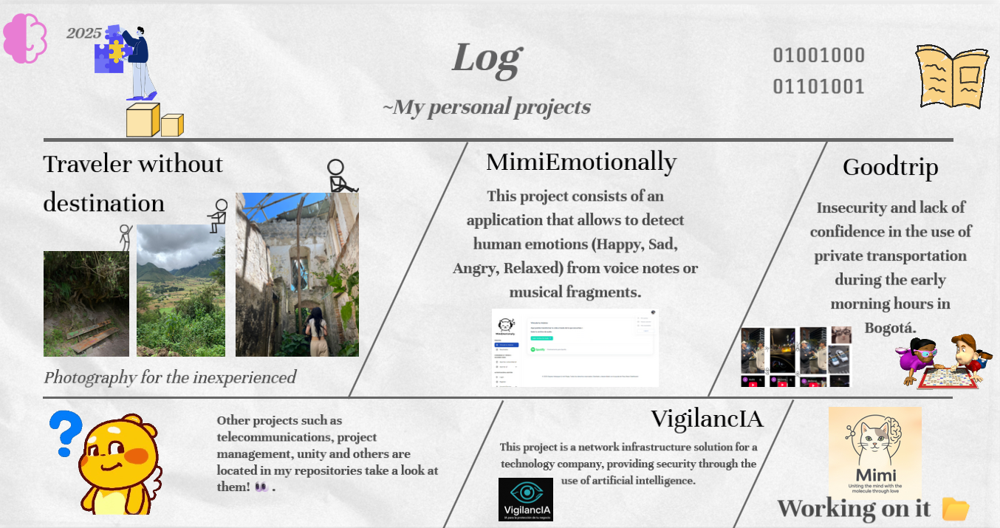

  <h1>Hi I'm dayana velasquez👋!</h1>
  <a>
  
  <a/>

  <em>Systems Engineering student - Mathematician under construction - Dreamer with AI - Lover of art in everyday life.</em>

---

🎓 I study **Systems Engineering** at Universidad EAN and **Mathematics** at Universidad de los Andes.

🧠 Currently, I develop **Artificial Intelligence** projects, focusing on **mathematical optimization**, **model training** and its **implementation in apps** with impact.

🧰 Tools and technologies:
- Python - JavaScript - C++ - MATLAB.
- Databases: DBeaver - Data Modeler - SQL - AWS
- Machine Learning - Neural Networks - Mathematical Modeling

💡 I am passionate about:
- AI that solves real problems.
- Databases as a knowledge structure
- Art that is born in the everyday
- Music as a universal language (🎹 & 🎸)

---

### 🛠️ Technologies and Tools

---

### 📊 GitHub Stats

  
  
  

---

### 🌐 Contact me at

  
  
  

---

  <em>"Everyone deserves to be heard and understood."</em>  
   
  <em>I enjoy what others consider ordinary. Therein lies the true beauty.</em>

---

⭐ Inspiration credits: [CtorW](https://github.com/CtorW)

